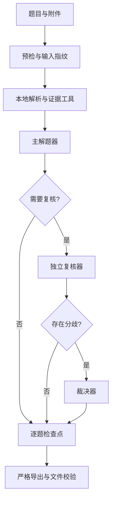

# Agent4GAIA

一个面向 [Hugging Face Agents Course Unit 4](https://huggingface.co/learn/agents-course/zh-CN/unit4/introduction) 与 [GAIA](https://huggingface.co/datasets/gaia-benchmark/GAIA) 的可续跑智能体命令行项目。它按题保存检查点，组合主解题、独立复核与争议裁决，并在导出前核对题目、答案和证据状态。

[English](README_EN.md) · [提交指南](SUBMISSION_GUIDE.md) · [配置示例](config.example.toml)

> **当前状态：** 本仓库没有发布经过校验的 301 题 test 答案文件，也不宣称 GAIA 正式榜成绩。模型调用会产生费用；请先用一题和 validation 试跑检查完整链路。

## 适用范围

| 工作流 | 数据 | 产物 | 提交位置 |
| --- | --- | --- | --- |
| 课程 Unit 4 | 课程指定的 20 道验证题 | 课程 API 所需的 JSON payload | [课程评分系统](https://agents-course-unit4-scoring.hf.space/docs) |
| 本地试跑 | GAIA validation 中固定抽取的 20 题，Level 1/2/3 为 6/10/4 | 私有的进度与评分报告 | 不提交正式榜 |
| GAIA 正式评测 | 2023 test 的 301 题，Level 1/2/3 为 93/159/49 | `gaia-test.jsonl` | [GAIA 排行榜](https://huggingface.co/spaces/gaia-benchmark/leaderboard)手动上传 |

课程分数与正式榜分数不可互换。GAIA 数据集需要登录 Hugging Face 并接受门控条款；test 标准答案不向本地开放。

## 快速开始

以下命令适用于项目根目录下的 Windows PowerShell，要求 Python 3.11+：

```powershell
py -m venv .venv
.\.venv\Scripts\python.exe -m pip install -e ".[audio,video]"
if (!(Test-Path config.toml)) { Copy-Item config.example.toml config.toml }
# 在私有的 config.toml 中填写可用的模型、端点和密钥
.\.venv\Scripts\python.exe -m gaia_agent.cli doctor
.\.venv\Scripts\python.exe -m gaia_agent.cli run course --runs .runs/course --limit 1
```

`doctor` 只检查配置，不调用模型。最后一条命令会请求课程题目并实际调用模型；如果需要附件，程序会先获取附件。`audio` 提供默认的本地语音转写，`video` 提供视频下载和处理依赖；纯开发测试可另装 `".[dev]"`。

### 配置要点

默认示例采用 DeepSeek 求解和裁决、Anthropic 独立复核。模型 ID、接口地址和额度必须以你实际使用的服务为准；示例值不保证任意网关都支持。

| 配置 | 用途 |
| --- | --- |
| `[deepseek]` 或 `DEEPSEEK_API_KEY` | 默认主解题、裁决和按需视觉描述 |
| `[anthropic]` 或 `ANTHROPIC_API_KEY` | `review_mode = "adaptive"` / `"always"` 时的独立复核；设为 `"off"` 可不配置 |
| `[huggingface]` 或 `HF_TOKEN` | 门控 GAIA 数据集与课程附件后备下载 |
| `TAVILY_API_KEY` | 可选的网页搜索来源；缺少可靠来源时会记录证据降级 |
| `[agent]` | 模型选择、复核模式、并发题数和单题工具预算 |

环境变量优先于 `config.toml`。该文件被 `.gitignore` 排除；不要把凭证写进 `config.example.toml`、README 或运行记录。可选的 OpenAI Responses 解题路径也在配置示例中说明。

## 运行评测

### 课程 20 题

单题检查通过后，在同一运行目录续跑；已完成题目默认跳过：

```powershell
.\.venv\Scripts\python.exe -m gaia_agent.cli run course --runs .runs/course
.\.venv\Scripts\python.exe -m gaia_agent.cli status course --runs .runs/course
.\.venv\Scripts\python.exe -m gaia_agent.cli export course --runs .runs/course --output .runs/course-payload.json --username YOUR_HF_USERNAME --agent-code https://huggingface.co/spaces/YOUR_HF_USERNAME/YOUR_SPACE/tree/main
```

`export course` 要求 20 道题均有有效答案，并要求 `agent-code` 指向可查看代码的公开 Space。`submit-course .runs/course-payload.json` 会**实际向课程系统提交**，请先检查 payload；它与正式 GAIA 排行榜上传是两条不同流程。

### GAIA 2023 test

先在有标准答案的 validation 集完成固定 20 题试跑。仅当评分报告中 `pilot_complete` 与 `meets_40_percent_gate` 均为 `true`，才开始正式 test：

```powershell
.\.venv\Scripts\python.exe -m gaia_agent.cli preflight validation --runs .runs/validation-pilot
.\.venv\Scripts\python.exe -m gaia_agent.cli run validation --runs .runs/validation-pilot --manifest .runs/validation-pilot/.meta/pilot-20.json
.\.venv\Scripts\python.exe -m gaia_agent.cli score-validation validation --runs .runs/validation-pilot --manifest .runs/validation-pilot/.meta/pilot-20.json --output .runs/validation-pilot/.meta/score.json

# 确认 score.json 的两个门槛字段后再执行以下命令
.\.venv\Scripts\python.exe -m gaia_agent.cli preflight test --runs .runs/test-official
.\.venv\Scripts\python.exe -m gaia_agent.cli run test --runs .runs/test-official
.\.venv\Scripts\python.exe -m gaia_agent.cli status test --runs .runs/test-official
.\.venv\Scripts\python.exe -m gaia_agent.cli export test --runs .runs/test-official --output .runs/gaia-test.jsonl
.\.venv\Scripts\python.exe -m gaia_agent.cli check-official .runs/gaia-test.jsonl
```

`preflight` 检查授权、附件、依赖和输入快照，不调用解题模型。正式导出要求全部 301 题完成、答案非空且单行，并阻止未解决的复核与证据问题。`check-official` 根据 test 元数据核对 UTF-8 JSONL、唯一题号和完整等级覆盖。通过后仍需人工复查并在[榜单页面](https://huggingface.co/spaces/gaia-benchmark/leaderboard)上传；CLI 不会自动提交正式榜。文件格式、表单字段与上传前检查见[提交指南](SUBMISSION_GUIDE.md)。

运行目录绑定代码、配置、题单和附件指纹。改变这些输入后，应使用新的 `--runs` 目录重新预检；同一目录可在中断后续跑。

## 工作原理



| 组件 | 实现 | 职责 |
| --- | --- | --- |
| 智能体角色 | `gaia_agent/agent.py`、`orchestrator.py`、`reviewer.py` | 求解、按需盲复核、分歧裁决 |
| 证据工具 | `attachments.py`、`media.py`、`web_tools.py`、`tools/` | 文档/表格提取、音视频与视觉检查、网页检索、只读表格查询和受限计算 |
| 状态与校验 | `memory.py`、`store.py`、`runmeta.py`、`validation.py` | 逐题记忆、阶段检查点、输入指纹、导出门槛 |
| 入口与评分 | `cli.py`、`scoring.py` | 批量运行、进度报告、validation 估算评分和文件检查 |

记忆只在当前题目内使用；本项目**没有**跨题自动学习或技能积累。视觉描述、音频转写、视频抽帧及匿名网页搜索都可能遗漏证据。搜索来源不足会标记降级，复核也不保证答案正确；请结合逐题记录核对关键数字、日期、单位和来源冲突。

## 开发与资料

```powershell
.\.venv\Scripts\python.exe -m pip install -e ".[audio,video,dev]"
.\.venv\Scripts\python.exe -m pytest -q
```

- [提交指南](SUBMISSION_GUIDE.md)：正式榜 JSONL、网页表单与上传检查。
- [配置示例](config.example.toml)：完整参数及密钥覆盖规则。
- [Space 演示](space/README.md)：课程公开代码链接所需的手动问答入口；发布包由 `scripts/build_space.py` 按白名单构建。
- [Agents Course Unit 4](https://huggingface.co/learn/agents-course/zh-CN/unit4/introduction) · [GAIA 数据集](https://huggingface.co/datasets/gaia-benchmark/GAIA) · [正式榜](https://huggingface.co/spaces/gaia-benchmark/leaderboard)

仓库不应包含 `config.toml`、`.runs/`、GAIA 题目或附件、验证答案及 test JSONL。公开演示 Space 也只接受用户手动输入，不托管题库。
