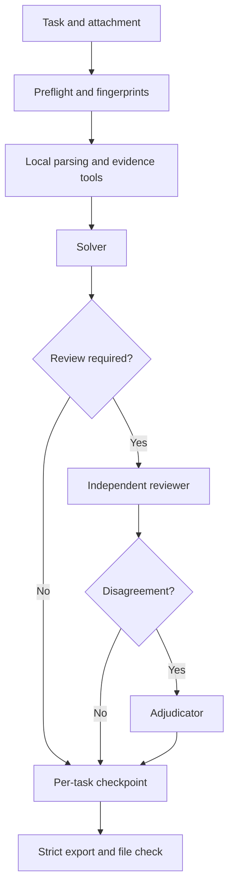

# Agent4GAIA

A resumable agent CLI for [Hugging Face Agents Course Unit 4](https://huggingface.co/learn/agents-course/en/unit4/introduction) and [GAIA](https://huggingface.co/datasets/gaia-benchmark/GAIA). It checkpoints each task, combines a solver with independent review and dispute adjudication, and validates task coverage, answers, and evidence before export.

[简体中文](README.md) · [Submission guide (Chinese)](SUBMISSION_GUIDE.md) · [Configuration template](config.example.toml)

> **Project status:** This repository does not publish a verified 301-question test answer file or claim an official GAIA leaderboard score. Model calls incur charges; start with one question and a validation pilot.

## Scope

| Workflow | Data | Output | Destination |
| --- | --- | --- | --- |
| Course Unit 4 | The course's 20 selected validation questions | JSON payload for the course API | [Course scoring service](https://agents-course-unit4-scoring.hf.space/docs) |
| Local pilot | A fixed 20-question GAIA validation sample, with Level 1/2/3 counts of 6/10/4 | Private progress and score reports | Never the official leaderboard |
| Official GAIA evaluation | All 301 questions in 2023 test, with Level 1/2/3 counts of 93/159/49 | `gaia-test.jsonl` | Manual upload to the [GAIA leaderboard](https://huggingface.co/spaces/gaia-benchmark/leaderboard) |

Course and official leaderboard scores are separate. The GAIA dataset requires a Hugging Face account with the gated terms accepted. Test answers are unavailable locally.

## Quick start

Run these commands from the project root in Windows PowerShell with Python 3.11+:

```powershell
py -m venv .venv
.\.venv\Scripts\python.exe -m pip install -e ".[audio,video]"
if (!(Test-Path config.toml)) { Copy-Item config.example.toml config.toml }
# Set working models, endpoints, and credentials in the private config.toml
.\.venv\Scripts\python.exe -m gaia_agent.cli doctor
.\.venv\Scripts\python.exe -m gaia_agent.cli run course --runs .runs/course --limit 1
```

`doctor` inspects configuration without calling a model. The last command fetches course tasks and makes real model calls; it downloads attachments when needed. The `audio` extra supplies the default local speech transcription, and `video` installs video download and processing dependencies. Install `".[dev]"` separately for development tests.

### Configuration

The template selects DeepSeek for solving and adjudication and Anthropic for independent review. Check model IDs, endpoints, and quota against your actual provider: template values are not guaranteed to work on every gateway.

| Setting | Purpose |
| --- | --- |
| `[deepseek]` or `DEEPSEEK_API_KEY` | Default solver, adjudicator, and on-demand visual description |
| `[anthropic]` or `ANTHROPIC_API_KEY` | Independent review with `review_mode = "adaptive"` or `"always"`; not needed with `"off"` |
| `[huggingface]` or `HF_TOKEN` | Gated GAIA access and fallback course attachment downloads |
| `TAVILY_API_KEY` | Optional search source; weak source coverage is recorded as degraded evidence |
| `[agent]` | Model selection, review mode, question concurrency, and per-task tool budget |

Environment variables override `config.toml`. The file is ignored by Git; never place credentials in `config.example.toml`, README files, or run records. The optional OpenAI Responses solver route is also documented in the template.

## Run evaluations

### Course: 20 questions

After the one-question check, resume in the same run directory. Completed tasks are skipped by default:

```powershell
.\.venv\Scripts\python.exe -m gaia_agent.cli run course --runs .runs/course
.\.venv\Scripts\python.exe -m gaia_agent.cli status course --runs .runs/course
.\.venv\Scripts\python.exe -m gaia_agent.cli export course --runs .runs/course --output .runs/course-payload.json --username YOUR_HF_USERNAME --agent-code https://huggingface.co/spaces/YOUR_HF_USERNAME/YOUR_SPACE/tree/main
```

`export course` requires 20 valid answers and an `agent-code` URL for a public Space with inspectable code. `submit-course .runs/course-payload.json` **writes to the course service**; inspect the payload first. This is separate from uploading to the official GAIA leaderboard.

### GAIA 2023 test

First complete a fixed 20-question pilot on validation, where reference answers exist. Start test only when both `pilot_complete` and `meets_40_percent_gate` are `true` in the score report:

```powershell
.\.venv\Scripts\python.exe -m gaia_agent.cli preflight validation --runs .runs/validation-pilot
.\.venv\Scripts\python.exe -m gaia_agent.cli run validation --runs .runs/validation-pilot --manifest .runs/validation-pilot/.meta/pilot-20.json
.\.venv\Scripts\python.exe -m gaia_agent.cli score-validation validation --runs .runs/validation-pilot --manifest .runs/validation-pilot/.meta/pilot-20.json --output .runs/validation-pilot/.meta/score.json

# Check both gate fields in score.json before continuing
.\.venv\Scripts\python.exe -m gaia_agent.cli preflight test --runs .runs/test-official
.\.venv\Scripts\python.exe -m gaia_agent.cli run test --runs .runs/test-official
.\.venv\Scripts\python.exe -m gaia_agent.cli status test --runs .runs/test-official
.\.venv\Scripts\python.exe -m gaia_agent.cli export test --runs .runs/test-official --output .runs/gaia-test.jsonl
.\.venv\Scripts\python.exe -m gaia_agent.cli check-official .runs/gaia-test.jsonl
```

`preflight` checks dataset access, attachments, dependencies, and the input snapshot without calling a solver model. Strict export requires all 301 tasks to be complete with nonempty, single-line answers and blocks unresolved review or evidence issues. `check-official` checks UTF-8 JSONL, unique task IDs, and complete level coverage against test metadata. Review the file and task evidence before manually uploading it to the [leaderboard](https://huggingface.co/spaces/gaia-benchmark/leaderboard); the CLI does not submit official results. See the [submission guide](SUBMISSION_GUIDE.md) for file format, form fields, and upload checks.

A run directory is bound to code, configuration, task manifest, and attachment fingerprints. After changing those inputs, preflight again in a new `--runs` directory. Interrupted work can resume in the same unchanged directory.

## Architecture



| Component | Implementation | Responsibility |
| --- | --- | --- |
| Agent roles | `gaia_agent/agent.py`, `orchestrator.py`, `reviewer.py` | Solve, trigger blind review when needed, adjudicate disagreements |
| Evidence tools | `attachments.py`, `media.py`, `web_tools.py`, `tools/` | Document and table extraction, audio/video and visual inspection, web search, read-only table queries, bounded calculation |
| State and validation | `memory.py`, `store.py`, `runmeta.py`, `validation.py` | Task-local memory, stage checkpoints, input fingerprints, export gates |
| CLI and scoring | `cli.py`, `scoring.py` | Batch execution, progress reports, approximate validation scoring, file checks |

Memory is **task-local**; there is no automatic cross-task learning or skill accumulation. Visual descriptions, transcription, sampled video frames, and public search can miss evidence. Weak search coverage is marked degraded, and independent review does not guarantee correctness. Inspect per-task records for critical numbers, dates, units, and conflicting sources.

## Development and references

```powershell
.\.venv\Scripts\python.exe -m pip install -e ".[audio,video,dev]"
.\.venv\Scripts\python.exe -m pytest -q
```

- [Submission guide (Chinese)](SUBMISSION_GUIDE.md): official JSONL, leaderboard form, and pre-upload checks.
- [Configuration template](config.example.toml): complete settings and credential overrides.
- [Space demo](space/README.md): manual question-and-attachment interface for the course's public code link; `scripts/build_space.py` builds an allowlisted release bundle.
- [Agents Course Unit 4](https://huggingface.co/learn/agents-course/en/unit4/introduction) · [GAIA dataset](https://huggingface.co/datasets/gaia-benchmark/GAIA) · [Leaderboard](https://huggingface.co/spaces/gaia-benchmark/leaderboard)

Keep `config.toml`, `.runs/`, GAIA questions and attachments, validation answers, and test JSONL out of the repository. The public demo Space accepts manually entered questions and does not host benchmark tasks.
